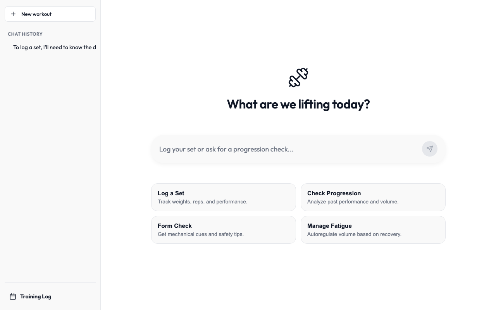
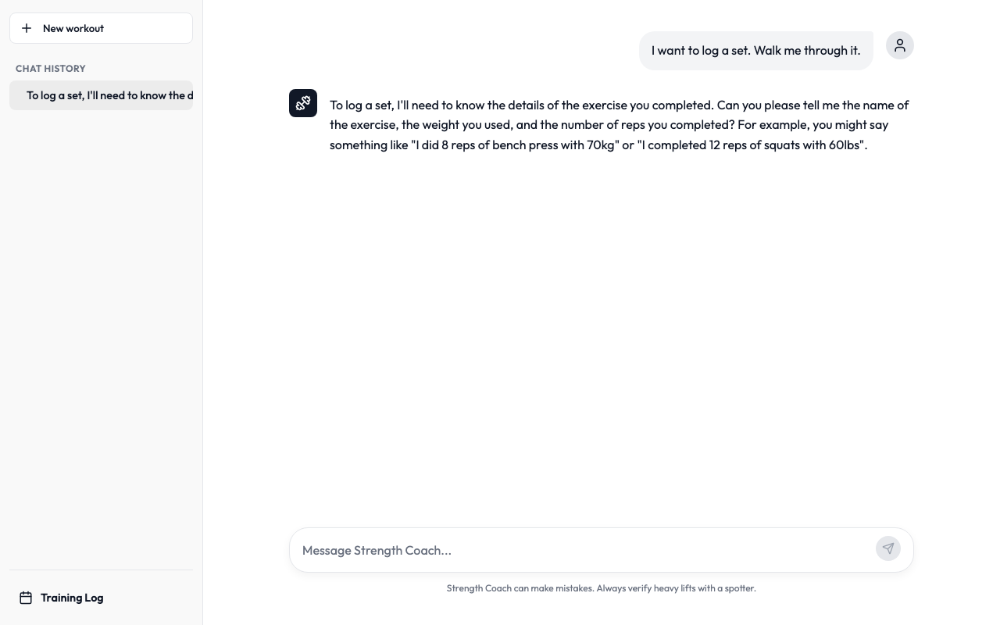
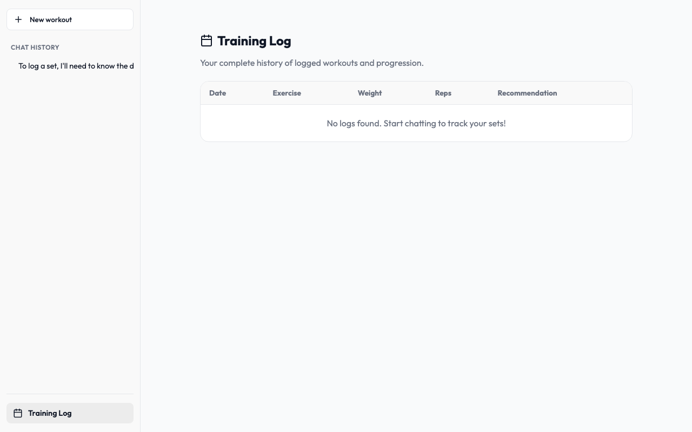
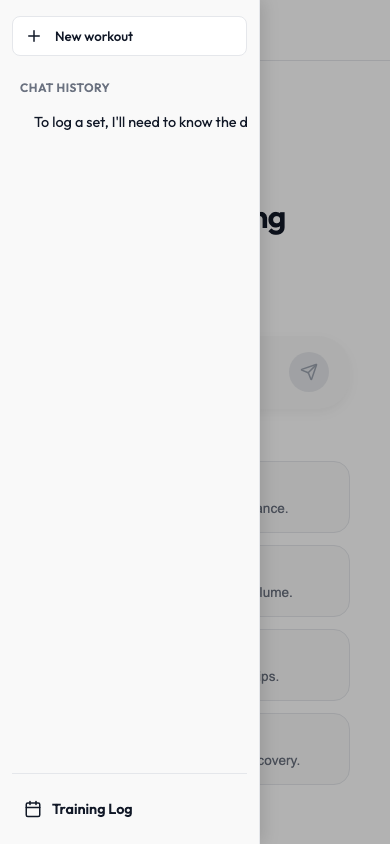

# Strength Coach

An AI-powered conversational training system that acts as a personal strength coach — logging sets, analyzing progression, providing form cues, and managing fatigue. Built with React, a Node/SQLite backend, and a streaming LLM interface that works with OpenAI-compatible providers (OpenAI, Groq).

---

## Screenshots

| Home | Chat with Set Logged | Training Log | Mobile Sidebar |
|------|---------------------|--------------|----------------|
|  |  |  |  |

> To regenerate: open `http://localhost:5173` and capture each view into `docs/screenshots/`.

---

## Architecture

```
┌─────────────────────────────────────────────────────────────────┐
│                        Browser (React)                          │
│                                                                 │
│  ┌──────────┐   ┌────────────────────────────────────────────┐  │
│  │ Sidebar  │   │              Main Content                  │  │
│  │          │   │                                            │  │
│  │ Sessions │   │  ┌──────────────────────────────────────┐  │  │
│  │ History  │   │  │  New Chat (hero + suggestion cards)  │  │  │
│  │          │   │  └──────────────────────────────────────┘  │  │
│  │ Training │   │               ── or ──                     │  │
│  │ Log link │   │  ┌──────────────────────────────────────┐  │  │
│  └──────────┘   │  │  Chat Area (messages + cards)        │  │  │
│                 │  └──────────────────────────────────────┘  │  │
│                 │  ┌──────────────────────────────────────┐  │  │
│                 │  │  Input Box (textarea + send)         │  │  │
│                 │  └──────────────────────────────────────┘  │  │
│                 └────────────────────────────────────────────┘  │
└────────────────────┬──────────────────┬─────────────────────────┘
                     │                  │
          ┌──────────▼──────┐  ┌───────▼──────────────────┐
          │  LLM Provider   │  │  Backend (Express + SQLite)│
          │                 │  │                            │
          │  OpenAI / Groq  │  │  /api/sessions             │
          │  streaming SSE  │  │  /api/sessions/:id/messages│
          │  + tool calls   │  │  /api/logs                 │
          └─────────────────┘  │  /api/recovery             │
                               │  /api/training-log         │
                               └────────────────────────────┘
```

### Key data flows

```
User types message
       │
       ▼
handleSend()
  ├─ create session if new (POST /api/sessions)
  ├─ save user message (POST /api/sessions/:id/messages)
  └─ processLLMResponse(history)
         │
         ▼
  streamLLMChat() ──► LLM API (SSE stream)
         │
         ├─ text delta ──► update message bubble in real time
         │
         └─ functionCall ──► executeTool()
                │                  │
                │            ├─ log_workout_set ──► POST /api/logs
                │            ├─ get_exercise_history ──► GET /api/logs?exercise=
                │            ├─ look_up_form ──► local form cues dict
                │            └─ log_recovery_metrics ──► POST /api/recovery
                │
                └─ render UI card + recurse with tool result ──► processLLMResponse()
```

### File map

```
conversational-system/
├── src/
│   ├── App.jsx              # Main component: state, chat logic, render
│   ├── index.css            # All active styles + media queries
│   └── lib/
│       ├── llm.js           # Provider detection, streamLLMChat entry point
│       ├── prompt.js        # SYSTEM_PROMPT (coaching persona + tool rules)
│       ├── tools.js         # Tool schemas + executeTool dispatcher
│       ├── api.js           # Thin fetch wrappers for backend REST API
│       └── adapters/
│           ├── openai.js    # OpenAI-compatible SSE streaming + tool call parsing
│           └── groq.js      # Groq adapter (wraps openai.js with Groq base URL)
└── server/
    └── index.js             # Express: SQLite CRUD + server-side progression logic
```

---

## User Journeys

### 1. Log a Set

1. Open app → hero screen with four suggestion cards
2. Click **"Log a Set"** or type e.g. `Bench press 80kg x 5`
3. Coach calls `log_workout_set` → set saved to SQLite
4. A **Set Logged** card appears showing exercise, weight, and reps
5. Coach replies with progression analysis — volume delta, next target weight
6. Session appears in the sidebar titled from the first model reply

> **Tool called:** `log_workout_set(exercise, weight, unit, reps)`

---

### 2. Check Progression

1. Click **"Check Progression"** → sends *"Check my bench press progression and tell me what to target next."*
2. Coach calls `get_exercise_history("bench press")` → fetches last 5 sets from DB
3. An **Analyzing Log History** card appears with set count
4. Coach responds with volume trend, PR analysis, and next-session target
5. If no history exists, coach asks you to log some sets first

> **Tool called:** `get_exercise_history(exercise)`

---

### 3. Form Check

1. Click **"Form Check"** → sends *"Give me form cues for squat."*
2. Coach calls `look_up_form("squat")` → returns cue string from built-in dict
3. A **Form Check: SQUAT** card appears with the cues
4. Coach walks through setup, execution, common mistakes, and primary cue

> **Tool called:** `look_up_form(exercise)`  
> **Supported:** squat, bench press, deadlift, overhead press (generic fallback for others)

---

### 4. Manage Fatigue

1. Click **"Manage Fatigue"** → sends *"I want to assess my readiness to train today. Ask me what you need."*
2. Coach asks for sleep hours, soreness (1–10), energy (1–10)
3. User provides metrics → coach calls `log_recovery_metrics`
4. A **Recovery Logged** card appears with all metrics
5. Coach gives a training recommendation: progress / maintain / deload

> **Tool called:** `log_recovery_metrics(sleep_hours, soreness_level, energy_level)`

---

### 5. Resume a Session

1. Click any session in the sidebar
2. Full message history loads from SQLite (including cards)
3. History is reconstructed as readable text for the LLM context so coaching memory is preserved
4. User continues the conversation; coach remembers prior sets and context

---

### 6. Training Log

1. Click **Training Log** in the sidebar
2. All logged sets and recovery entries appear sorted newest first
3. Each row shows date, exercise, weight, reps, and a server-side recommendation
4. Recommendations use double-progression logic comparing each set to the previous for that exercise

---

### 7. Mobile (hamburger menu)

1. On screens ≤ 768px the sidebar is hidden; the header shows a ≡ button
2. Tap ≡ → sidebar slides in from left with a dimmed overlay behind it
3. Tap the overlay, a session item, Training Log, or New Workout → sidebar closes automatically

---

## Setup

### Prerequisites

- Node.js 18+
- An API key for OpenAI or Groq

### Install

```bash
# Frontend deps
npm install

# Backend deps
cd server && npm install && cd ..
```

### Configure

Copy `.env.example` to `.env` and fill in your key:

```env
# Groq (free tier, fast)
VITE_GROQ_API_KEY=gsk_...

# — or — OpenAI
VITE_OPENAI_API_KEY=sk-...
VITE_OPENAI_MODEL=gpt-4o   # optional, defaults to gpt-4o
```

### Run

```bash
# Terminal 1 — SQLite REST API on :3001
node server/index.js

# Terminal 2 — Vite dev server on :5173
npm run dev
```

Open `http://localhost:5173`.

---

## LLM Provider Support

| Provider | Env var | Default model |
|----------|---------|---------------|
| Groq | `VITE_GROQ_API_KEY` | `llama-3.3-70b-versatile` |
| OpenAI | `VITE_OPENAI_API_KEY` | `gpt-4o` |

Set `VITE_LLM_PROVIDER=groq` or `VITE_LLM_PROVIDER=openai` to force a provider. If both keys are absent, the app errors with a clear message. Any OpenAI-compatible endpoint can be used by editing `src/lib/adapters/openai.js`.

---

## Tools (function calling)

| Tool | When triggered | What it does |
|------|---------------|--------------|
| `log_workout_set` | User reports exercise + weight + reps | Saves to `logs` table; returns saved record |
| `get_exercise_history` | User asks about progression for a named exercise | Returns last 5 sets for that exercise |
| `look_up_form` | User asks for form cues or reports discomfort | Returns cues from built-in dict |
| `log_recovery_metrics` | User provides sleep/soreness/energy data | Saves to `recovery` table |

The coach will **not** call tools with missing or placeholder values — it asks the user for specific data first (enforced via system prompt rules).

---

## Database Schema

```sql
CREATE TABLE logs (
  id        INTEGER PRIMARY KEY AUTOINCREMENT,
  exercise  TEXT NOT NULL,
  weight    REAL NOT NULL,
  unit      TEXT NOT NULL,       -- 'kg' or 'lbs'
  reps      INTEGER NOT NULL,
  date      TEXT NOT NULL,
  timestamp DATETIME DEFAULT CURRENT_TIMESTAMP
);

CREATE TABLE recovery (
  id             INTEGER PRIMARY KEY AUTOINCREMENT,
  sleep_hours    REAL,
  soreness_level INTEGER,        -- 1–10
  energy_level   INTEGER,        -- 1–10
  notes          TEXT,
  date           TEXT NOT NULL,
  timestamp      DATETIME DEFAULT CURRENT_TIMESTAMP
);

CREATE TABLE sessions (
  id        INTEGER PRIMARY KEY AUTOINCREMENT,
  title     TEXT NOT NULL,
  timestamp DATETIME DEFAULT CURRENT_TIMESTAMP
);

CREATE TABLE messages (
  id         INTEGER PRIMARY KEY AUTOINCREMENT,
  session_id INTEGER NOT NULL REFERENCES sessions(id),
  role       TEXT NOT NULL,      -- 'user' or 'model'
  content    TEXT,
  card_data  TEXT,               -- JSON blob for UI cards
  timestamp  DATETIME DEFAULT CURRENT_TIMESTAMP
);
```

---

## Future Enhancements

### Multi-user Auth & Per-user Session Manager

The app is currently single-user (no auth, no `user_id` scoping). The planned path to multi-user:

#### 1. Auth layer — Clerk (or Better Auth)

Add Clerk for OAuth / email sign-in. This handles sessions, JWTs, and the sign-in UI with minimal code:

```bash
npm install @clerk/clerk-react
```

Wrap the app in `<ClerkProvider>`, gate routes with `<SignedIn>` / `<SignedOut>`, and extract `userId` from `useAuth()` on every request.

#### 2. DB schema — add `user_id` to all tables

```sql
ALTER TABLE sessions  ADD COLUMN user_id TEXT NOT NULL DEFAULT '';
ALTER TABLE messages  ADD COLUMN user_id TEXT NOT NULL DEFAULT '';
ALTER TABLE logs      ADD COLUMN user_id TEXT NOT NULL DEFAULT '';
ALTER TABLE recovery  ADD COLUMN user_id TEXT NOT NULL DEFAULT '';
```

Index `user_id` on `sessions` and `logs` for query performance.

#### 3. Backend — scope every query

Pass the JWT from the frontend (`Authorization: Bearer <token>`), verify it with Clerk's SDK in an Express middleware, then attach `req.userId` to every handler:

```js
// middleware
const { userId } = await clerkClient.verifyToken(req.headers.authorization.split(' ')[1]);
req.userId = userId;

// scoped query (example)
db.all(`SELECT * FROM sessions WHERE user_id = ? ORDER BY timestamp DESC`, [req.userId], ...);
```

All `INSERT` statements receive `req.userId` as the `user_id` value.

#### 4. Frontend — user-level session sidebar

The sidebar currently shows all sessions globally. After auth:

- Sessions are fetched with the user's JWT attached → only their sessions return
- A user avatar / sign-out button replaces the hamburger area on desktop
- "New workout" creates a session tagged to the current `userId`
- Loading a session verifies `session.user_id === currentUserId` before rendering

#### 5. Storage — move to Postgres for concurrent writes

SQLite works fine for a single user. For multiple concurrent users replace it with Postgres (e.g. Supabase free tier):

```bash
npm install pg
```

The query interface is nearly identical; replace `db.run` / `db.all` with `pool.query`. No schema changes beyond the `user_id` columns above.

#### Migration path summary

| Step | Effort | Dependency |
|------|--------|------------|
| Add Clerk auth | ~2 hrs | `@clerk/clerk-react`, `@clerk/express` |
| Add `user_id` columns + index | ~30 min | DB migration script |
| Scope backend queries | ~2 hrs | Clerk server SDK |
| Scoped sidebar + auth UI | ~2 hrs | `useAuth()`, `<UserButton>` |
| Postgres (optional for scale) | ~1 day | `pg`, hosted Postgres |
